# 🎨 Visual Workflow Diagrams & Technical Specifications

## Calicut Spice Traders - AI Enhancement Architecture

---

## 🏗️ **SYSTEM ARCHITECTURE OVERVIEW**

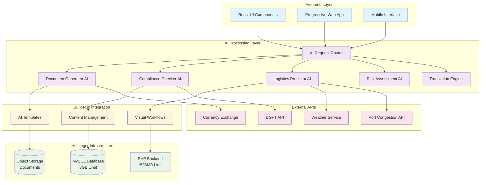

---

## 🔄 **AI DOCUMENT GENERATION WORKFLOW**

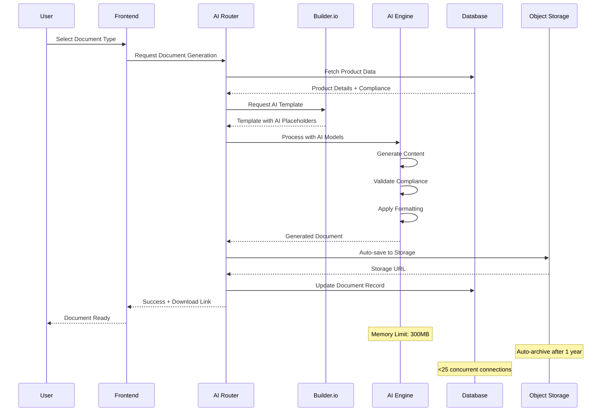

---

## 🌍 **MULTILINGUAL COMPLIANCE WORKFLOW**

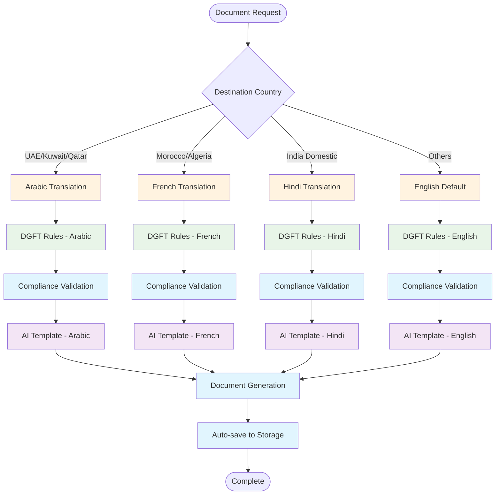

---

## 📈 **PREDICTIVE LOGISTICS ALGORITHM**

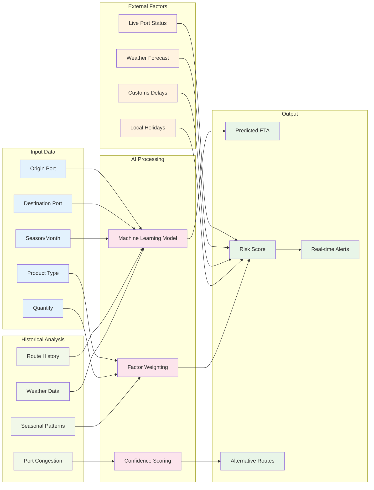

---

## 🔄 **REAL-TIME RISK MONITORING SYSTEM**

```mermaid
stateDiagram-v2
    [*] --> Monitoring: Shipment Started

    Monitoring --> LowRisk: Normal Parameters
    Monitoring --> MediumRisk: Minor Threshold Breach
    Monitoring --> HighRisk: Major Threshold Breach
    Monitoring --> CriticalRisk: Multiple Failures

    LowRisk --> Monitoring: Continuous Monitoring
    LowRisk --> MediumRisk: Parameter Change

    MediumRisk --> LowRisk: Issue Resolved
    MediumRisk --> HighRisk: Escalation
    MediumRisk --> AlertTeam: Send Notification

    HighRisk --> MediumRisk: Mitigation Applied
    HighRisk --> CriticalRisk: Severe Escalation
    HighRisk --> AutoResponse: Trigger Actions

    CriticalRisk --> Emergency: Emergency Protocol
    CriticalRisk --> AutoResponse: Immediate Action

    AlertTeam --> Monitoring: Team Notified
    AutoResponse --> Monitoring: Action Taken
    Emergency --> [*]: Manual Intervention

    note right of LowRisk: Temperature: Normal<br/>Humidity: Normal<br/>Location: On Track
    note right of MediumRisk: Temperature: Slight Deviation<br/>Humidity: Outside Range<br/>Location: Minor Delay
    note right of HighRisk: Temperature: Critical<br/>Humidity: Damaging Levels<br/>Location: Significant Delay
    note right of CriticalRisk: Multiple Critical Failures<br/>Communication Lost<br/>Emergency Response Needed
```

---

## 🏛️ **DATABASE OPTIMIZATION ARCHITECTURE**

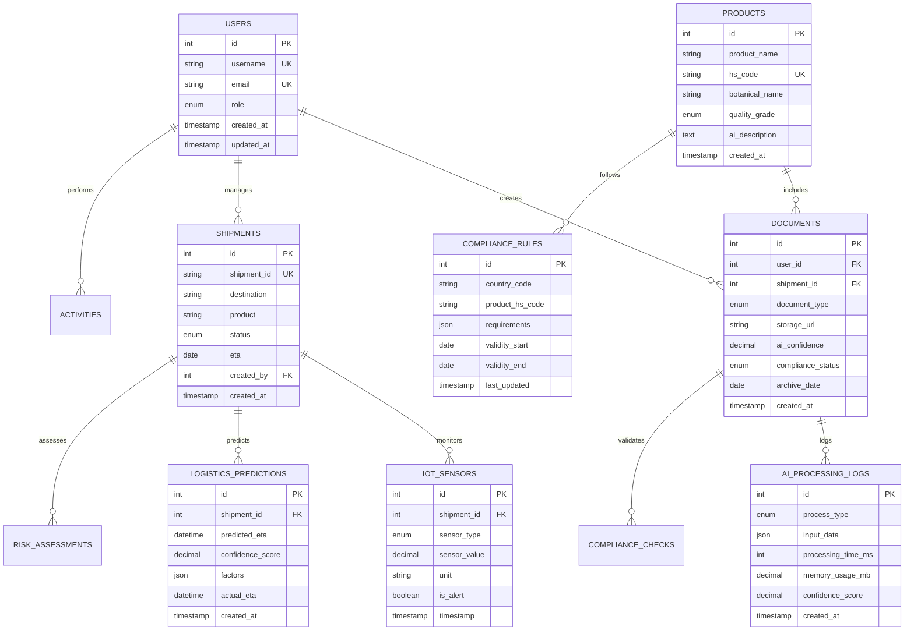

---

## 🚀 **BUILDER.IO VISUAL WORKFLOW BUILDER**

```mermaid
flowchart TB
    subgraph "Builder.io Visual Interface"
        DragDrop[Drag & Drop Components]
        VisualEditor[Visual Workflow Editor]
        PreviewMode[Live Preview Mode]
    end

    subgraph "AI Template Components"
        HeaderComp[Document Header Component]
        ProductComp[Product Details Component]
        ComplianceComp[Compliance Statement Component]
        SignatureComp[Digital Signature Component]
        QRComp[QR Code Component]
    end

    subgraph "Dynamic Data Sources"
        UserData[User Profile Data]
        ProductData[Product Database]
        ComplianceData[DGFT Rules Engine]
        ShipmentData[Shipment Information]
        AIGenerated[AI-Generated Content]
    end

    subgraph "Output Formats"
        PDFOutput[PDF Document]
        HTMLOutput[HTML Preview]
        JSONOutput[JSON Data Export]
        APIOutput[API Integration]
    end

    DragDrop --> HeaderComp
    DragDrop --> ProductComp
    DragDrop --> ComplianceComp
    DragDrop --> SignatureComp
    DragDrop --> QRComp

    VisualEditor --> UserData
    VisualEditor --> ProductData
    VisualEditor --> ComplianceData
    VisualEditor --> ShipmentData
    VisualEditor --> AIGenerated

    HeaderComp --> PDFOutput
    ProductComp --> PDFOutput
    ComplianceComp --> HTMLOutput
    SignatureComp --> JSONOutput
    QRComp --> APIOutput

    PreviewMode --> PDFOutput
    PreviewMode --> HTMLOutput

    classDef builder fill:#fff3e0
    classDef components fill:#f3e5f5
    classDef data fill:#e8f5e8
    classDef output fill:#e1f5fe

    class DragDrop,VisualEditor,PreviewMode builder
    class HeaderComp,ProductComp,ComplianceComp,SignatureComp,QRComp components
    class UserData,ProductData,ComplianceData,ShipmentData,AIGenerated data
    class PDFOutput,HTMLOutput,JSONOutput,APIOutput output
```

---

## 📱 **MOBILE PWA ARCHITECTURE**

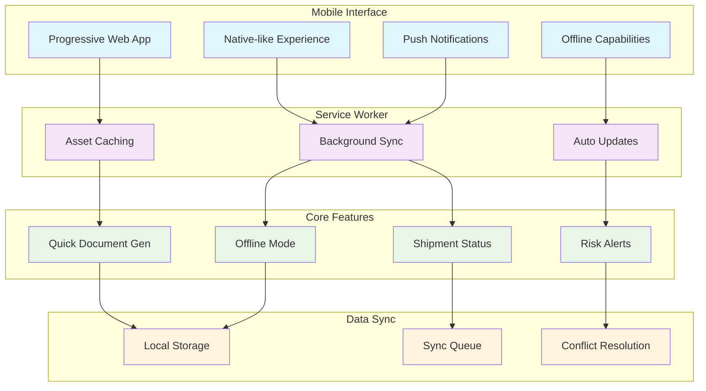

---

## 🔄 **MEMORY OPTIMIZATION FLOW**

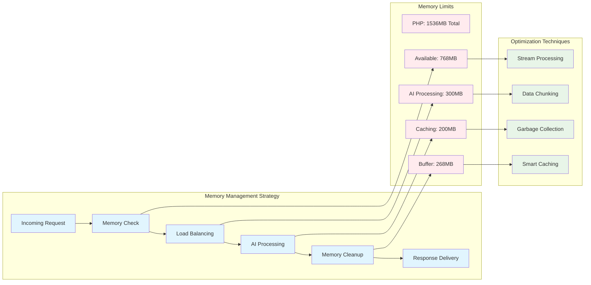

---

## 📊 **RESOURCE MONITORING DASHBOARD**

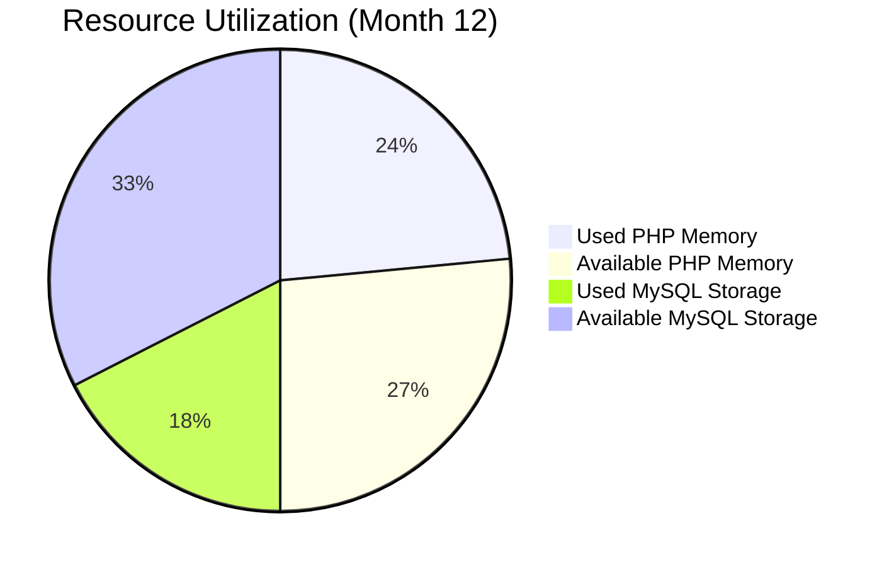

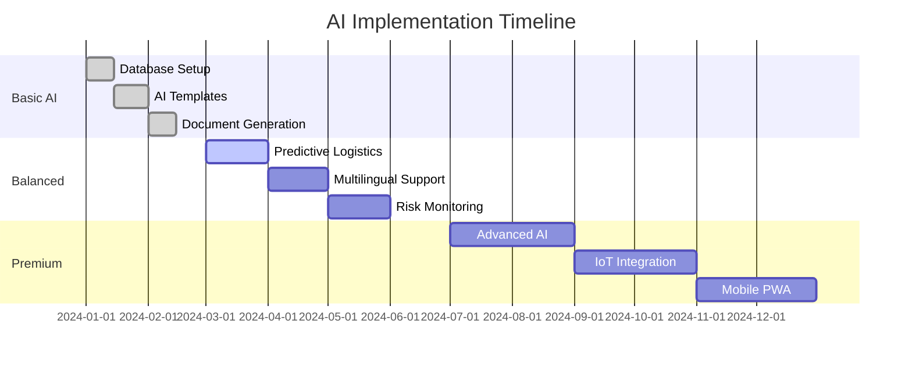

---

## 🎯 **PERFORMANCE METRICS VISUALIZATION**

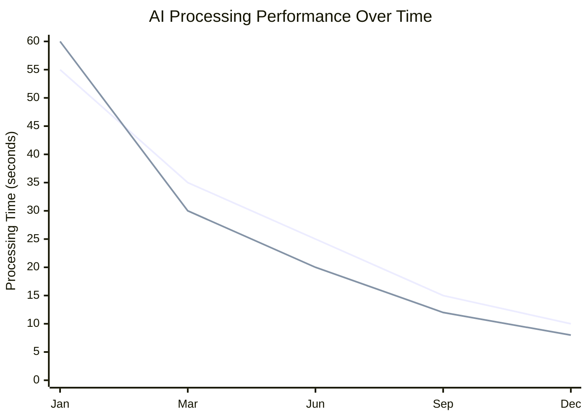

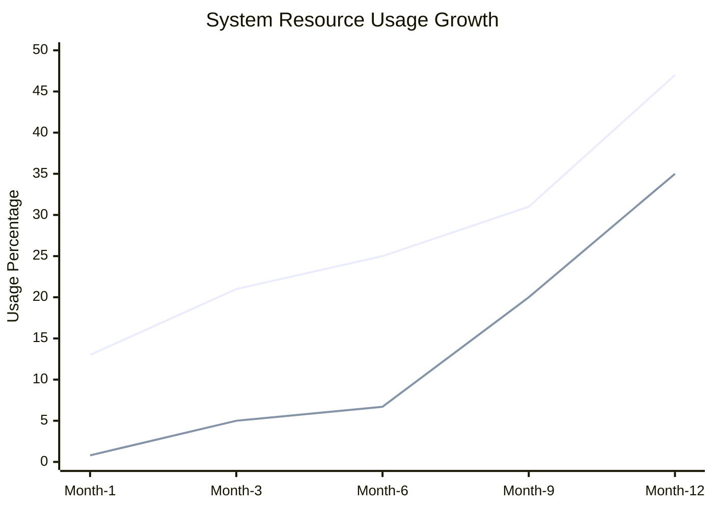

---

## 🔐 **SECURITY & COMPLIANCE ARCHITECTURE**

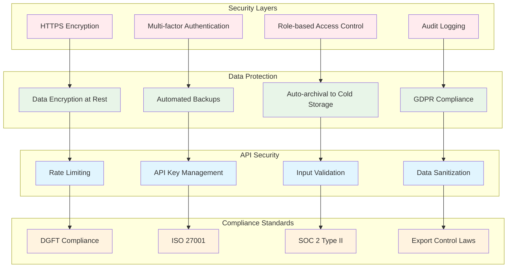

This comprehensive visual workflow documentation provides clear architectural guidance for implementing the AI-enhanced Calicut Spice Traders workspace while maintaining optimal resource utilization within Hostinger's constraints.
